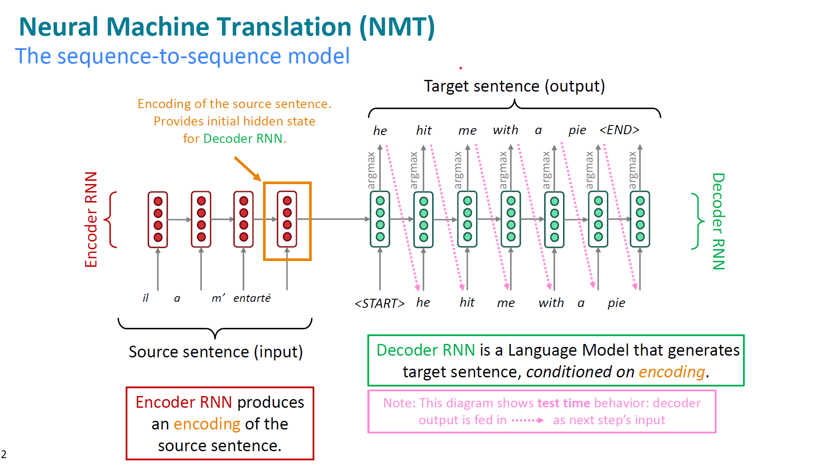
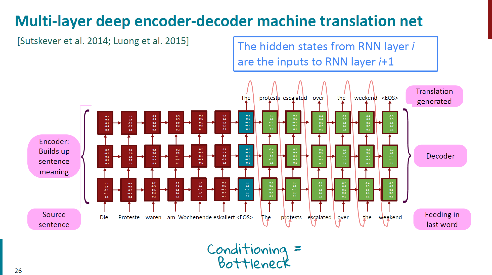

# CS224N & UPC Course 
# UPC Course 2 NERC
## Modern Technology (from paper with code)

# Lecture 7 Seq2Seq & Neural Machine Translation

**Sequence-to-Sequence model** is a **Conditional Language Model**
**Advantage:**
* Better performance: more fluent; better use context; better use of phrase similarities. 
* A single neural network to be optimized end-to-end
* Require much less human engineering effort

**Disadvantage**
* Less interpretable
* Diffcult to control: for example, can not easily specify rules or guidelines for translation; safety concerns!! 

## Application of Seq2Seq 
* Summarization 
* Dialogue (previous utterances $\rightarrow$ next utterance)
* Parsing 
* Code Generation 

## Neural Machine Translation 

### Perplexity 

In general, perplexity is a measurement of how well a probability model predicts a sample. In the context of Natural Language Processing, perplexity is one way to evaluate language models.
A language model is a probability distribution over sentences: it’s both able to generate plausible human-written sentences (if it’s a good language model) and to evaluate the goodness of already written sentences. Presented with a well-written document, a good language model should be able to give it a higher probability than a badly written document, i.e. it should not be “perplexed” when presented with a well-written document. 

$$perplexity(S) = p(w_1, w_2, w_3, ..., w_m) ^ {-\frac{1}{m}}$$

## Training a Neural Machine Translation System 
End-to-end encoder-decoder architecture 
* Single Layer LSTM

* Multi Layer LSTM
 

### Greedy Decoding 
Generate the target sentence by taking argmax on each step of the decoder 

### Exhauustive Search decoding 
Find a (length T) translation y that maximizes 
$$P(y_1|x) = P(y_1|x)P(y_2|y_1,x) P(y_3|y_2, y_2, x) \\
= \prod_{t=1}^T P(y_t| y_1,..., y_{t-1} | x)  $$

**Complexity is far too expensive!!**

### **Beam Search**
**On each step of decoder, keep track of the k most probable partial translations** (which we call hypotheses)
* **k** is the beam size (in practice **around 5~10**) 
* Score of the sequence of translation is defined as its log probability: 
$$Score(y_1, y_2, ... , y_t) = log P_{LM}(y_1,y_2, ..., y_t | x) = \sum_{t=1}^t P_{LM}(y_i | y_1, ..., y_{i-1}, x)$$

* Problem with this: **longer hypotheses have lower scores.**
* Fix this problem: Normalize by length. Use this to select top one instead: 
$$\frac{1}{t} log P_{LM}(y_i | y_1, ..., y_{i-1}, x) $$  

### Evaluation of MT
#### BLEU (Bilingual Evaluation Understudy)  
BLEU compares the machine-written translation to one or several human-written translation(s), and computes a similarity score based on:
* **n-gram precision** (usually 1, 2, 3, 4 grams) 
* Plus a penalty for too-short system translations 

But BLEU is useful but imperfect!! 
#### Diffuculties of NMT 
Many difficulties remains:
* OOV words 
* Domain mismatch 
* Maintaining context over longer text 
* Low-resource language pairs
* Failures to accurately capture sentence meaning 
* Pronoun (or zero pronoun) resolution errors 
* Morphological agreement errors 
* NMT bais (gender bais)
* Uninterpretable 

### Attention in NMT (from Coursera DL by Andrew Ng)

//

##    # Code Implementation 

#### BLEU 
#### BPE 

#### ELMO

