# CS224N & UPC Course 
## Paper of the year 
1. [A Survey of Transformers](https://arxiv.org/pdf/2106.04554.pdf)  
2. [Effcient Transformers: A Survey]()

## NLP Task Review
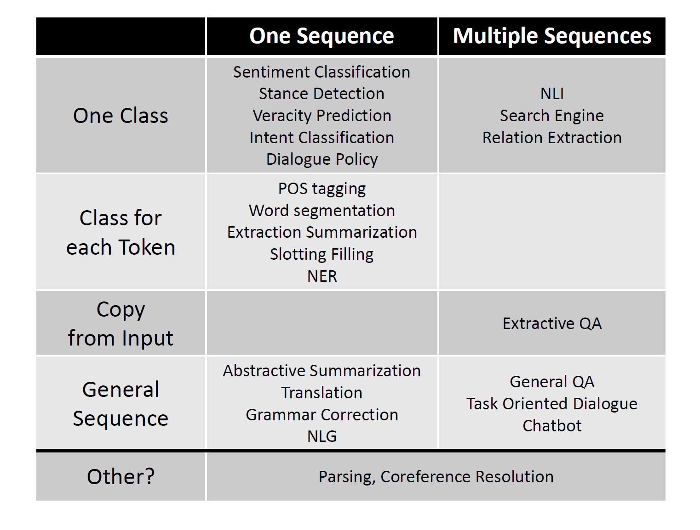

$$
Input = 
\begin{cases}
One sentence,   \\ 
Multiple sentences 
\end{cases}
$$

$$
Output = 
\begin{cases}
One Class  \\ 
Class for each token \\ 
Copy from input  \\ 
General sequence 
\end{cases}
$$


# UPC Course 
## Lecture 2 NERC

## Lecture 7 Seq2Seq & Neural Machine Translat

**Sequence-to-Sequence model** is a **Conditional Language Model**
**Advantage:**


* Better performance: more fluent; better use context; better use of phrase similarities. 
* A single neural network to be optimized end-to-end
* Require much less human engineering effort

**Disadvantage**
* Less interpretable
* Diffcult to control: for example, can not easily specify rules or guidelines for translation; safety concerns!! 

## Application of Seq2Seq 
* Summarization 
* Dialogue (previous utterances $\rightarrow$ next utterance)
* Parsing 
* Code Generation 

## Neural Machine Translation 

###  Attention Mechanism 
This part mainly refer to Deep learning specialization Course 5 in Coursera. 
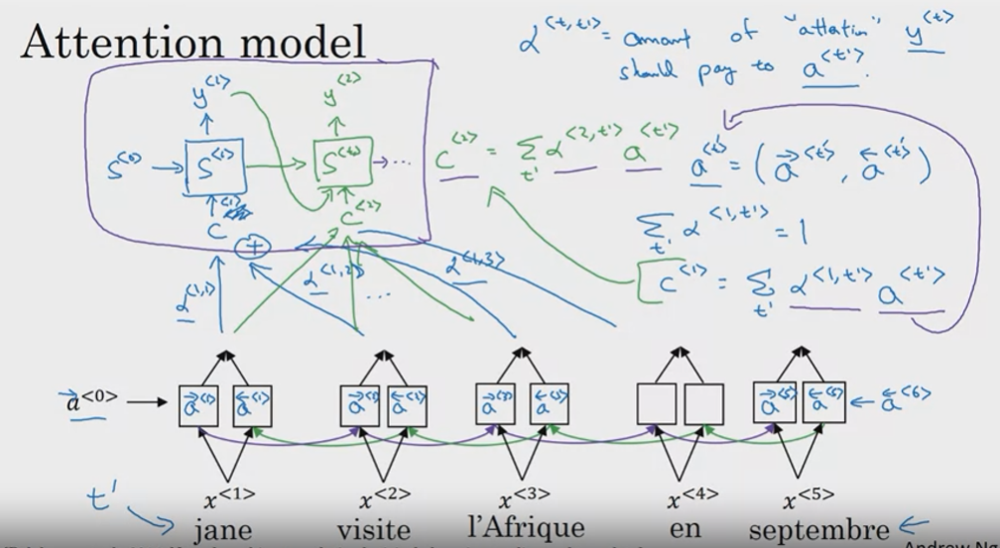
$$\alpha^{t, t^{\prime}} = \text{amount of 'attention' $y^{<t>}$ should pay to $a^{<t^{\prime}>}$}$$
$$c^{<1>} = \sum_{t^{\prime}} \alpha^{<1, t^\prime>} a^{<t\prime>} \quad c^{<2>} = \sum_{t^{\prime}} \alpha^{<2, t^\prime>} a^{<t\prime>}$$
$$\vec{a}^{<t\prime>} = (\overrightarrow{a}^{<t\prime>}, \overleftarrow{a}^{<t\prime>})$$

#### How to compute $\alpha^{t}$
$$\alpha^{<t,t^{\prime}>} = \frac{exp(e^{<t, t^{\prime}>})}{\sum_{t^\prime=1}^{T_x} exp(e^{<t, t^\prime>})}$$ 

#### How to compute $e^{<t, t\prime>}$
Basically in the course it introduce an small neural network to generate scalar $e^{<t, t^\prime>}$, but not in detail. 
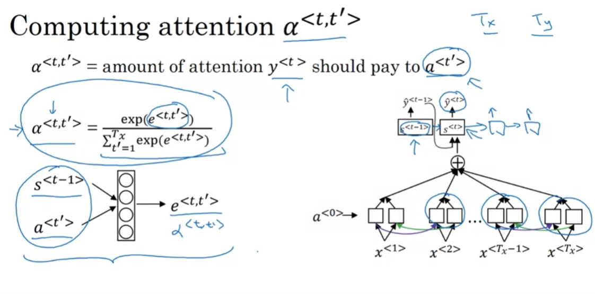

```
# Implementation of Bleu Score 
def 

```

### Evaluation 

#### BLEU Score
Example to calculate BELU score:
**Ref1:** The cat is on the mat. 
**Ref2:** There is a cat on the mat. 

**MT Output:**  The cat the cat on the mat.

Firstly we get the bigram of the MT output: the cat, cat the, the cat, cat on, on the, the mat; the we count 

| Item     | Count  | Count Clip | 
|----------|--------|----------|
| the cat  | 2      |  1       |
| cat the  | 1      |  0       |  
| cat on   | 1      |  1       |
| on the   | 1      |  1       |
| the mat  | 1      |  1       |

1. BLEU Score of unigram
   $$P_1 = \frac{\sum_{unigram \in \hat{y}} Count_{clip}(Unigram)}{{\sum_{unigram \in \hat{y}} Count(Unigram)}}$$
2. BLEU Score of ngram 
    $$P_n = \frac{\sum_{gram \in \hat{y}} Count_{clip}(ngram)}{{\sum_{ngram \in \hat{y}} Count(ngram)}}$$ 
3. Combined BLEU Score: **Instead using only ngram(n equals to a certain value)**, it is more realistic to use combined metric:
   $$C ombined_{BLEU} = BP * exp(\frac{1}{4} \sum_{n=1}^1 P_n)$$  where BP is defined in the following as a penality fort too short translation (more specifically )

$$
BP = 
\begin{cases}
1 ,    \quad \text{if MT-output-length > reference-output-length} \\ 
exp(1- MT-output-length / reference-output-length),  \text{if $n$ is odd}
\end{cases}
$$
#### BLEU Score Implementation
Refer to 'codes/bleu_score.py' 

## Training a Neural Machine Translation System 
End-to-end encoder-decoder architecture 
* Single Layer LSTM


* Multi Layer LSTM
 

### Greedy Decoding 
Generate the target sentence by taking argmax on each step of the decoder 

### Exhauustive Search decoding 
Find a (length T) translation y that maximizes 
$$P(y_1|x) = P(y_1|x)P(y_2|y_1,x) P(y_3|y_2, y_2, x) \\
= \prod_{t=1}^T P(y_t| y_1,..., y_{t-1} | x)  $$

**Complexity is far too expensive!!**

### **Beam Search**
**On each step of decoder, keep track of the k most probable partial translations** (which we call hypotheses)
* **k** is the beam size (in practice **around 5~10**) 
* Score of the sequence of translation is defined as its log probability: 
$$Score(y_1, y_2, ... , y_t) = log P_{LM}(y_1,y_2, ..., y_t | x) = \sum_{t=1}^t P_{LM}(y_i | y_1, ..., y_{i-1}, x)$$

* Problem with this: **longer hypotheses have lower scores.**
* Fix this problem: Normalize by length. Use this to select top one instead: 
$$\frac{1}{t} log P_{LM}(y_i | y_1, ..., y_{i-1}, x) $$  

### Evaluation of MT
#### BLEU (Bilingual Evaluation Understudy)  
BLEU compares the machine-written translation to one or several human-written translation(s), and computes a similarity score based on:
* **n-gram precision** (usually 1, 2, 3, 4 grams) 
* Plus a penalty for too-short system translations 

But BLEU is useful but imperfect!! 
#### Diffuculties of NMT 
Many difficulties remains:
* OOV words 
* Domain mismatch 
* Maintaining context over longer text 
* Low-resource language pairs
* Failures to accurately capture sentence meaning 
* Pronoun (or zero pronoun) resolution errors 
* Morphological agreement errors 
* NMT bais (gender bais)
* Uninterpretable 

### Lecture 9 Self Attention and Transformers

Issues with recurrent models:
1. Linear interaction distance 
2. Lack of parallelizability: GPU can perform a bunch of independent computations at once! But future RNN hidden state can not be computed in full before past RNN hidden states have been computed. 
3. Word window models aggregate local contexts 
4. Maximum Interaction distance = sequence length / window size

[1] [Attention is all you need](https://arxiv.org/abs/1706.03762)

#### Self Attention 
Barriers and solutions for Self-Attention as a building block. 
1. **Problem**: Since there are no element wise non linearities, self attention is simply performing a re averaging of the value vectors; **Solution**: Apply a feedforward layer to the output of attention, providing non linear activation (and additional expressive power). 
2. **Problem**: Since self attention doesn’t build in order information, we need to encode the order of the
sentence in our keys, queries, and values. **Solutions**: Sinusoidal position representations - concatenate sinusoidal functions of varying periods. 
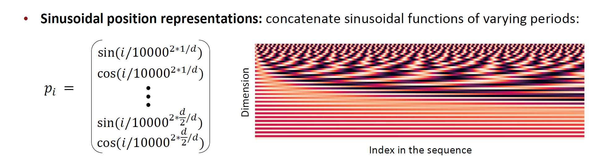
Remark: We can try Position representation vectors learned from scratch, see more in lecture9 slides. 

#### Transformers Milestone
State-of-the-art in most NLP tasks are achieved by Transformer and Attention-based models. 
1. 2017: Transformer was introduced by Google 
2. 2018: **Bidirectional Encoder Representations from Transformers (BERT)** by Google 
3. 2019: Several BERT-inspired models such as **RoBERTa** and **BART** by Facebook, **XLNet** by Google and CMU, and  many more.
4. Adding more models for efficient Transformer. -- Model reduction strategies such as distillation (DistilBERT, DistilRoBERTa, ...) and pruning; Other simplied BERT-like models such as A Lite BERT (ALBERT), MobileBERT. 
5. 2020: Generative Pre-trained Transformer 3 (GPT-3) by OpenAI, achieves state-of-the-art in language generation. Still in active research.
6. 2022: Highly optimized huge language models: **DeepSpeed** by Facebook, **PaLM** by Google. 


#### Transformers Architecture 
full view of Encoder-Decoder architecture:  
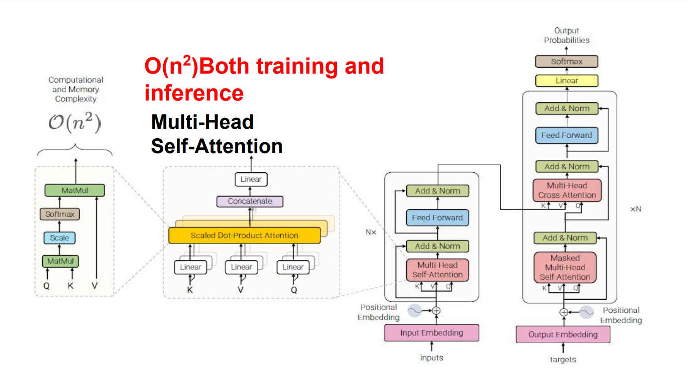 


##### Encoder 
1. **Positional Encoding** 
2. **Multi-head Self-Attention**
   $$A_h = Softmax(\alpha Q_h K_h^T) V_h$$
   Remark: why multi-heads 
   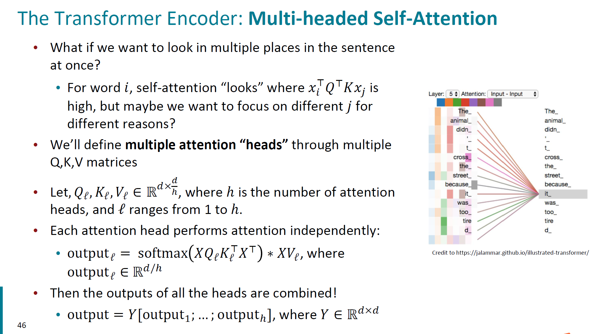 
3. **Scaled Dot Product**

4. **Feed Forward Layer**
   **Problem:** Since there are no element wise non linearities, self
attention is simply performing a re averaging of the value vectors. 
**Easy fix**: Apply a feedforward layer to the output of attention,
providing non linear activation (and additional expressive power).
$$m_i = MLP(output_i) = W_2 * ReLU(W_1 * output_i + b_1) + b_2$$

5. **Residual Connection**: residual connections are thought to make the loss landscape considerably smoother; Gradient can backpropagate through residual connections. 
   $X^{(i)} = X^{(i-1)} + Layer(X^{(i-1)}) $
   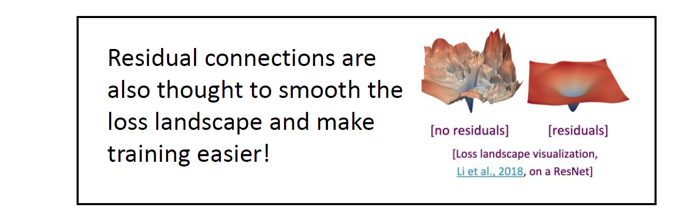

6. **Layer Normalization** 
   Its success may be due to its normalizing gradients. [Xu et al., 2019](https://arxiv.org/abs/1911.07013) 
   **Problem:** Difficult to train the parameters of a given layer because its input from the layer beneath keeps shifting.
   **Solution:** Reduce uninformative variation by normalizing to zero mean and standard deviation of one within each layer
   
   $$\text{Mean}: \mu = \frac{1}{H} \sum_{i=1}^H a_i^l  \quad Std: \sigma^l = \sqrt{\frac{1}{H} \sum_{i=1}^H (a_i^l - \mu^l)^2}$$

   $$x^{l^\prime} = \frac{x^l - \mu^l}{\sigma^l + \epsilon}$$ 


##### Decoder  -- 这里真的要补充
***TO BE CONTINUE***
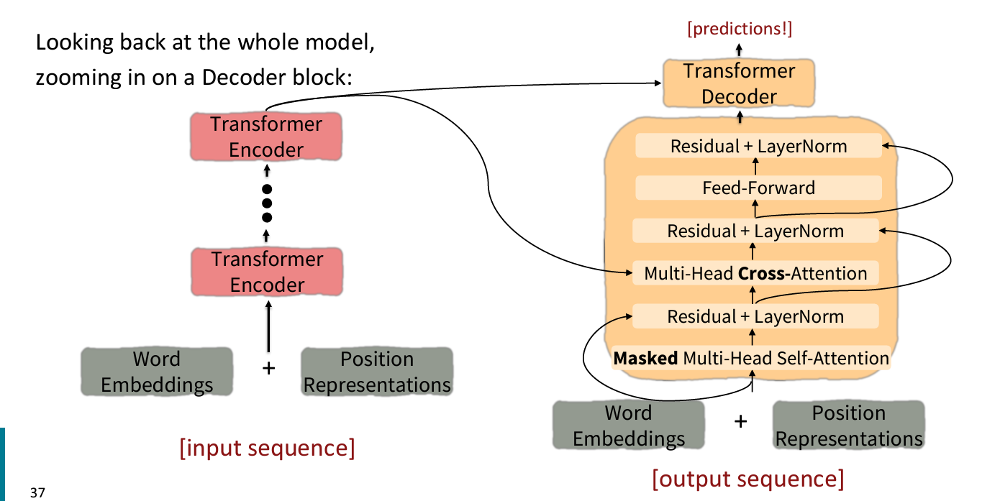

We us **Masked Multi Head Self Attention** to keep the decoder from cheating. (Masking the future in self attention). To enable parallelization, we mask out attention to future words by setting attention scores to $-\infty$. 
1.  Masked Multi Head Self Attention 
2.  Encoder-Decoder Attention 
3.  A Feed forward layer (with residual connections and layer norm)
4.  A final linear layer to project the embeddings into a much longer vector of length vocab size (logits)
5.  Add a final softmax to generate a probability distribution of possible next words!
**Cross Attention**

#### Transformer Model Usage 
* **Encoder-Decoder**  The full Transformer architecture as introduced in Sec. 2.1 is used. This is typically used in sequence-to-sequence modeling (e.g., neural machine translation).
* **Encoder only**  Only the encoder is used and the outputs of the encoder are utilized as a representation for the input sequence. This is usually used for classification or sequence labeling problems.
* **Decoder only** Only the decoder is used, where the encoder-decoder cross-attention module is also removed. This is typically used for sequence generation, such as language modeling.

#### Drawbacks of transformers

* Quadratic compute in self attention (today): Computing all pairs of interactions means our computation grows quadratically with the sequence length!

* Position representations: Are simple absolute indices the best we can do to represent position? : 1. Improvement1: [Relative linear position attention](https://arxiv.org/abs/1803.02155); 2.Improvement2: [Dependency syntax based position.](https://arxiv.org/pdf/1909.00383.pdf)

#### Improvement of Transformers 
1. Can we build models like Transformers without paying the $𝑂(𝑇^2)$ all pairs self attention cost?: [**Linformer**]() 

#### Do Transformer Modifications Transfer?

## Pretrained Model (with hugging-face implementation)

### Overview 
Contextual word embedding 

Small BERT including **Distill BERT**, **Tiny BERT**, **Mobile BERT**, **Q8BERT**, **ALBERT**... 

**Network Architecture**: mainly designed for processing longer sequence, for instance: **XLNET**(Transformer-XL), 

**Two steps of Using huge models:** Pretrain -> finetune(Task Specific data with annotations) 

### How to Pretrain 
**Refer to  Hongyi Lee's [DLHLP 2020] BERT and its family lecture - ELMo, BERT, GPT, XLNet, MASS, BART, UniLM, ELECTRA, and more.**
Bert is pretrained by masking input, and there are multiple ways to do masking input pretrain:
**1.Original Bert mask which is subword masking** according to Bert tokenization method. fixed mask?? 
**1.Dynamic Masking**: refer to [Roberta](https://arxiv.org/abs/1907.11692)  
**1.Mask whole words** refer to [Pre-Training with Whole Word Masking for Chinese BERT](https://arxiv.org/abs/1906.08101?amp=1)
**1.Phrase-level & Entity-level masking** refer to [ERNIE: Enhanced Language Representation with Informative Entities](https://arxiv.org/abs/1905.07129) 
**1.Span Masking** refer to [SpanBert](https://arxiv.org/abs/1907.10529)
**1.** 

Bert can not talk? Which means Bert is not good at generation task. 

### How to Fine-tune 
Refer to [DLHLP 2020] BERT and its family - Introduction and Fine-tune from Hongyi Lee.  
**Dealing with inputs**: 
1. **One sentence input** is quite simple; 
1. **Multiple sentences input**:  Seperated by **[SEP]** token. 
1. Bert model input starts with a **[CLS]** token. 
**If we are ouput one element** for instance classification problem, probably we will add a **[CLS]** token at the beginning of Bert input. 


### Bert and its variants
#### How to compress models
**Network Compression** :  
* Network Pruning 
* Knowledge Distillation 
* Parameter Quanitization 
* Architecture Design 

#### Network Architecture
* **XLNet**
* Transfomer-XL 
* **Roberta**
* **Albert & Distill Bert**
* **GPT**
* **MASS**
* **Bart**
* **ELECTRA**
* **ENIRE**
* **T5**
* **Reformer**
* **Linformer**
* **Big Bird**


**There are actually so many ways to make a more efficient Bert, for this one can refer to [a very interesting survey from Google](https://arxiv.org/abs/2009.06732).**

Only **Encoder** architecture of Transformers. 


#### Subword Tokenizer 


### Megatron 
### NLP Turning 

### Efficient Self-Attention


## QA(Question Answering) 
* **Input**: Several sequences 
* **Output**: sequencde
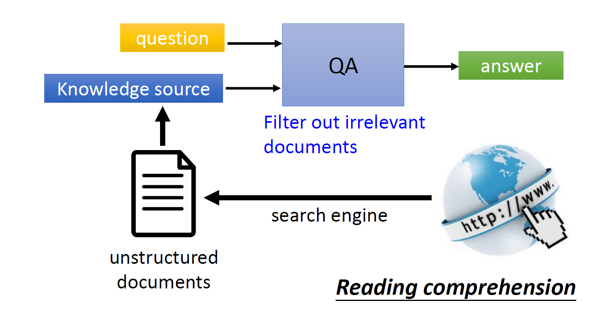

## Dialogue
Dialogue tasks: **Chatting**; **Task-oriented**. 
**Task-oriented** ： 

Dialogue $\rightarrow$ Preprocessing by NLU (Natural Language Understanding) State Tracker $\rightarrow$  State  $\rightarrow$ Policy $\rightarrow$  Action $\rightarrow$ NLG  


## NLU (Natural Language Understanding) 
NLU Task: 
* Intent Classification 
* Slot Filling 

## NLG (Natural Language Generation)  

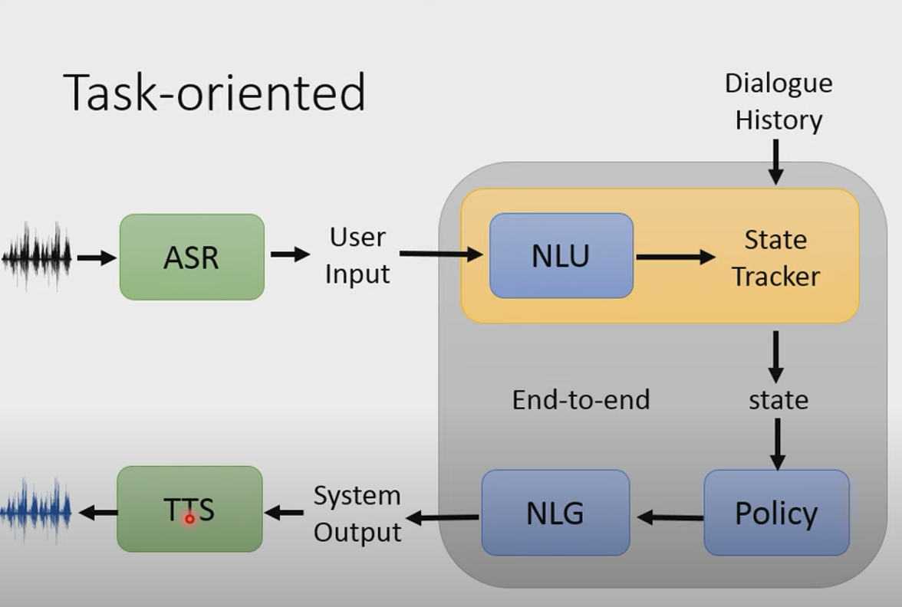


### Evaluation 
#### Perplexity 

In general, perplexity is a measurement of how well a probability model predicts a sample. In the context of Natural Language Processing, perplexity is one way to evaluate language models.
A language model is a probability distribution over sentences: it’s both able to generate plausible human-written sentences (if it’s a good language model) and to evaluate the goodness of already written sentences. Presented with a well-written document, a good language model should be able to give it a higher probability than a badly written document, i.e. it should not be “perplexed” when presented with a well-written document. 

$$perplexity(S) = p(w_1, w_2, w_3, ..., w_m) ^ {-\frac{1}{m}}$$

### ROUGE Metrics
ROUGE, or Recall-Oriented Understudy for Gisting Evaluation,[1] is a set of metrics and a software package used for evaluating automatic summarization and machine translation software in natural language processing. The metrics compare an automatically produced summary or translation against a reference or a set of references (human-produced) summary or translation.


## Knowledge Graph 
This task can be oversimplified in the following way: 
* Extract Entity 
* Extract Relation (Acually a classification problem) 

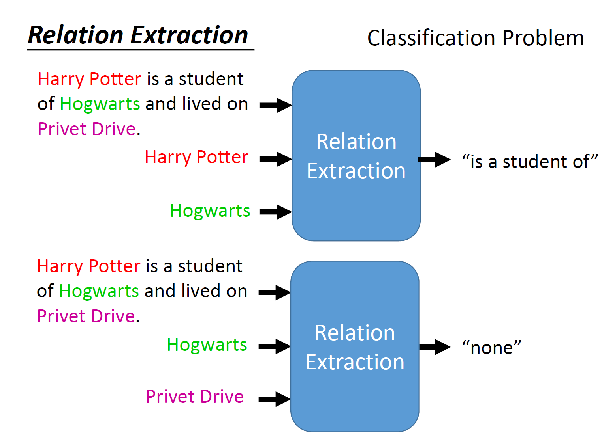 


## Dataset & Benchmark

### GLUE (General Language Understanding Evaluation)
GLUE also has Chinese Version 


Corpus of Linguistic Acceptability (CoLA)
•Stanford Sentiment Treebank (SST-2)
•Microsoft Research Paraphrase Corpus (MRPC)
•QuoraQuestion Pairs (QQP)
•Semantic Textual Similarity Benchmark (STS-B)
•Multi-Genre Natural Language Inference (MNLI)
•Question-answering NLI (QNLI)
•Recognizing Textual Entailment (RTE)
•WinogradNLI (WNLI)


### Super GLUE


### DecaNLP 


##  Code Implementation 


### ELMO 
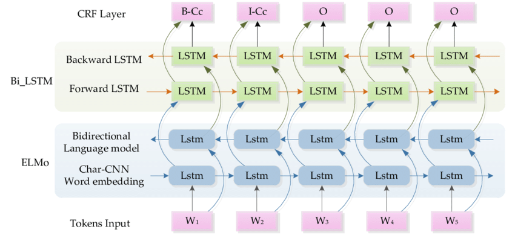
#### Structure
1. Char cnn 
   * **Inputs**: [b, max_sentence_len, max_word_len]      
   * **Preprocess**: Transpose Input: [b*max_sentence_len, embedding_dim, max_word_len].    
   * **CNN layers**： 接下来将其送入到多个kernel size（卷积核大小）和out channel（通道维度）不同的卷积层中，每个filter对应的卷积层最后输出[b*max_sentence_len, out_channel, new_h], 
   * Filter configuration: [ [1, 32], [2, 32], [3, 64], [4, 128], [5, 256], [6, 512], [7, 1024] ]. After concatenation we finally get 2048 channel in total. ( $new_h=[h-kernelsize+2p/stride] +1 $, $[]$ 表示向下取整。)  
   * 然后[b * max_sentence_len, out_channel, new_h]会经过一个max pool层，在new_h维度上做最大池化，得到[b * max_sentence_len, out_channel]，然后把多个卷积层得到的输出在out_channel维度上进行concat，假设concat最后的维度是n_filters，得到[b*max_sentence_len, n_filters]，其中n_filters=2048. 
   
   * Two High way layer： $$y = g*x + (1-g) * f(A(x)), \quad g = Sigmoid(B(x))$$, here the output dimension keeps $[b*max-sentence-len, n-filters]$
   * Finally a linear projection layer, out_dim = 512. Then reshape the output into $[b, max-sentence-len, output-dim]$ which is the encoding of Char cnn. 

2. Bi-LSTM 

    * char cnn encoder的输出经过forward layer得到[b, max_sentence_len, hidden_size]，其中hidden_size=512  
    * char cnn encoder的输出经过backward layer得到[b, max_sentence_len, hidden_size]，其中hidden_size=512 将前向和后向的在hidden_size为维度做concat得到[b, max_sentence_len, 2*hidden_size]
  
    *注意： Bi_LSTM 有2层，并且他们之间有Skip connections，即两层BiLSTM之间有残差网络相连，也就是说第一层的输出不仅作为第二层的输入，同时也会和第二层的输出相加。返回的时候，也会分别返回2层最后得到的representation，即在Bi_LSTM层最后返回的是[num_layers, b, max_sentence_len, 2*hidden_size]，num_layer=2，表示2层Bi_LSTM层.* 


经过上面，最后句子的表示会得到3层representation：
最底下的层是token_embedding，基于char cnn得到，对上下文不敏感
第一层Bi LSTM得到的对应token的embedding，这一层表示包含了更多的语法句法信息（syntax）
第二层Bi LSTM得到的对应token的embedding，这一层表示包含了更多的词义的信息（word sense）


#### ELMO Implementation 
##### Char CNN
1. Preprocessing 
2. Convolutions
3. Highway Layer
    A [Highway layer](https://arxiv.org/abs/1505.00387) does a gated combination of a linear transformation and a non-linear transformation of its input.  :math: $y = g * x + (1 - g) *
    f(A(x))$, where :math:`A` is a linear transformation, :math: $f$ is an element-wise non-linearity, and :math:$g$ is an element-wise gate, computed as :math:$sigmoid(B(x))$.
    This module will apply a fixed number of highway layers to its input, returning the final result.  

4. The first 


5. Projection  

##### BiLSTM

##### NN Configuration 

```

_options = {"lstm":
               {"use_skip_connections": 'true',
                "projection_dim": 512,
                "cell_clip": 3,
                "proj_clip": 3,
                "dim": 4096,
                "n_layers": 2},
            "char_cnn":
               {"activation": "relu",
                "filters": [[1, 32], [2, 32], [3, 64], [4, 128], [5, 256], [6, 512], [7, 1024]],
                "n_highway": 2,
                "embedding": {"dim": 16},
                "n_characters": 262,
                "max_characters_per_token": 50}
    }
``` 

##### 

    
```

# pytorch 1.8.0

from allennlp.modules.elmo import Elmo, batch_to_ids

model_dir = 'E:/pretrained_model/elmo_original/'
options_file = model_dir+'elmo_2x4096_512_2048cnn_2xhighway_options.json'
weights_file = model_dir+'elmo_2x4096_512_2048cnn_2xhighway_weights.hdf5'

num_output_representations = 2 # ??? 

elmo = Elmo(
		options_file=options_file,
        weight_file=weights_file,
        num_output_representations=num_output_representations,
        dropout=0
		)

sentence_lists = [['I', 'have', 'a', 'dog', ',', 'it', 'is', 'so', 'cute'],
                  ['That', 'is', 'a', 'question'],
                  ['an']]
    
character_ids = batch_to_ids(sentence_lists) #    
print('character_ids:', character_ids.shape) # [3, 11, 50]    

res = elmo(character_ids)    
print(len(res['elmo_representations']))  # 2   
print(res['elmo_representations'][0].shape)  # [3, 9, 1024]    
print(res['elmo_representations'][1].shape)  # [3, 9, 1024]  


```

#### BLEU 
#### BPE 

#### ELMO


### Appendix 
#### Three ways to build torch model
* **torch.nn.ModuleList()** 
  ```
  self._layers = torch.nn.ModuleList(
            [torch.nn.Linear(input_dim, input_dim * 2) for _ in range(num_layers)]
        )
  ```

* **torch.nn.Sequential**
  ```
  import torch.nn as nn

  # Example of using Sequential
  model = nn.Sequential(  # OrderedDict
          nn.Conv2d(1,20,5),
          nn.ReLU(),
          nn.Conv2d(20,64,5),
          nn.ReLU())
 
  ```
  
* **torch.**


